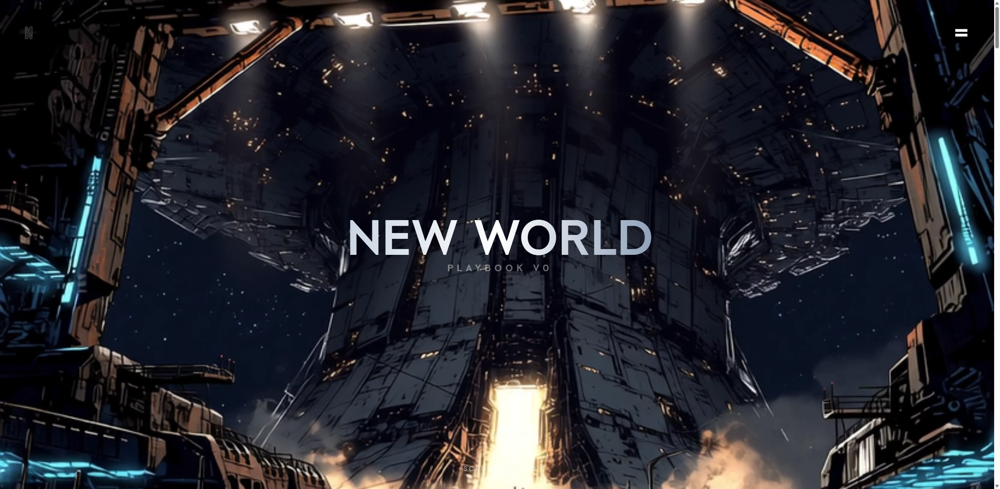
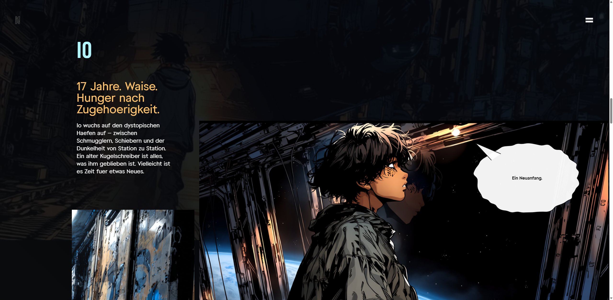
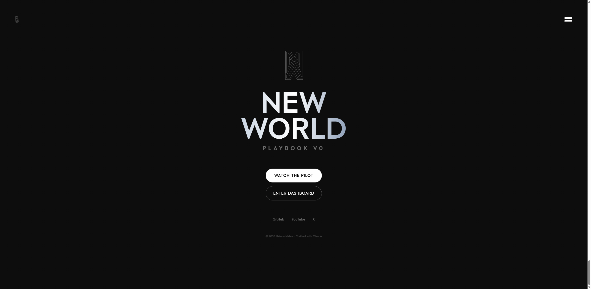

<p align="center">
  
</p>

<h1 align="center">NEW WORLD</h1>
<p align="center"><strong>Playbook V0</strong></p>

<p align="center">
  Ein Raumschiff. Eine Crew. Neun Regeln.<br>
  Ein Playbook fuer das KI-Zeitalter — erzaehlt als Space-Pirate-Saga.
</p>

<p align="center">
  
  
  
  
  
  
</p>

---

## Was ist das hier?

**New World** ist ein transmediales Projekt an der Schnittstelle von Technologie, Storytelling und Philosophie. Die Kernidee: Ein Playbook fuer die KI-Aera — verpackt in eine semi-realistische Anime-Space-Opera.

Dieses Repository ist die **Landing Page** — ein scroll-getriebenes, cineastisches Web-Erlebnis, das die Welt, die Charaktere und den Ton der Serie vorstellt.

> *"The Ultra Nova is not a place, weapon, or treasure. The Ultra Nova is a state. It's the moment when all rules work together — when a person has internalized everything, when the crew stands united, when human and machine work in full co-intelligence."*

---

## Die Welt

### Das Schiff: New World

Das Schiff ist gleichzeitig Raumschiff *und* KI. Es denkt, spricht, analysiert, empfiehlt. Die Crew lebt und arbeitet **in** der KI. Ohne einen Menschen am Steuer mit Aufmerksamkeit (Regel 0) treibt es ziellos.

Die Spannung: **Wer steuert wen?**

### Die Charaktere

<table>
  <tr>
    <td width="50%">
      <h4>Io</h4>
      <em>17 Jahre. Waise. Hunger nach Zugehoerigkeit.</em><br><br>
      Aufgewachsen auf dystopischen Raumhaefen zwischen Schmugglern und Schiebern. Ein alter Kugelschreiber ist alles, was ihm geblieben ist. Er ist der Leser — wir lernen mit ihm.
    </td>
    <td width="50%">
      <h4>Captain Kid</h4>
      <em>Anfang 40. Breit. Verwittert. Gefaehrlich ruhig.</em><br><br>
      Hat die New World gebaut — oder sie hat ihn gefunden. Traegt einen Titanring und Loetbrand-Narben. Sagt: "Wer die Regeln versteht, darf bleiben. Wer sie bricht, geht."
    </td>
  </tr>
</table>

### Die 9 Regeln

| # | Regel | Bedeutung |
|---|-------|-----------|
| **0** | Aufmerksamkeit ist alles | Ohne Bewusstsein ist jede Handlung blind |
| **1** | Neugier ist der staerkste Antrieb | Neugier &rarr; Bewegung &rarr; Lernen &rarr; Wachstum |
| **2** | Veraenderung ist der Normalzustand | Transformation annehmen, nicht bekaempfen |
| **3** | Denke schnell. Passe dich schneller an | Adaptionsgeschwindigkeit > Perfektion |
| **4** | Energie transformiert, verschwindet nie | Jeder Fehler = Energie zum Umwandeln |
| **5** | Alles ist Datenpunkt UND Beziehung | Systeme = Information + Verbindung |
| **6** | Iteration schlaegt Perfektion | Ein Zyklus > tausend Plaene |
| **7** | Intelligenz ist Kooperation | Mensch + Mensch + Maschine = Co-Intelligenz |
| **8** | Chaos &rarr; Struktur = Kreation | Ordnung schaffen ist der fundamentale kreative Akt |
| **9** | Das Playbook lebt | V0 ist der Anfang. Update dein Denken wie deinen Code |

---

## Screenshots

<p align="center">
  
  <br>
  <em>Io Section — Scroll-getriebene Parallax-Bilder mit handgezeichneten Manga Speech Bubbles</em>
</p>

<p align="center">
  
  <br>
  <em>Outro — Call to Action mit NW Monogramm</em>
</p>

---

## Tech Stack

| Layer | Technologie | Zweck |
|-------|-------------|-------|
| **UI** | React 19 | Komponentenarchitektur |
| **Build** | Vite 6 | Dev-Server + HMR auf Port 3050 |
| **Styling** | Tailwind CSS 4 | Utility-first, Custom Fonts (Long, Round, Round Bold) |
| **Animation** | GSAP 3.13 + ScrollTrigger | Scroll-Scrubbing, Parallax, Timeline-Animationen |
| **Manga Bubbles** | Custom SVG + Seeded PRNG | Handgezeichnete Speech Bubbles ohne externe Abhaengigkeit |
| **Container** | Docker + Compose | Node 20 Alpine, Hot-Reload via Volume Mount |

### Visueller Stil

```
40% Realismus + 30% Anime + 30% Industrial Sci-Fi
```

| Token | Hex | Rolle |
|-------|-----|-------|
| Neon Cyan | `#b3f5ff` | Navigation, Daten-Akzente, Highlights |
| Amber Gold | `#ffc46b` | Waerme, Schiffsinterieur, Emotion |
| Coal Black | `#0d0d0d` | Deep Space, Haupthintergrund |

---

## Scroll-Architektur

Die Seite ist ein einziges, durchkomponiertes Scroll-Erlebnis:

```
Hero                    Scroll-Mask-Reveal + Video
  |
FirstVideo              Scroll-Scrubbing (Video synced mit Scroll-Position)
  |
Io                      Charakter-Showcase + Manga Bubbles + Parallax
  |
SecondVideo             Scroll-Scrubbing
  |
Kid                     Captain Kid Charakter-Showcase
  |
PostCard                Interaktive Karte + Video
  |
Final                   Abschluss-Video
  |
Outro                   CTA + Social Links
```

### Technische Highlights

- **Scroll-Scrubbing Videos** — GSAP ScrollTrigger manipuliert `video.currentTime` direkt, kein Autoplay
- **CSS Mask Animation** — Hero-Section nutzt animierte `mask-image` fuer progressives Reveal
- **Manga Speech Bubbles** — Prozedural generierte SVG-Pfade mit seeded PRNG fuer deterministische Hand-Draw-Aesthetik. Vier Typen: `normal`, `shout`, `thought`, `narration`. Poppen per `back.out(1.7)` Ease rein, verschwinden beim Zurueckscrollen
- **Parallax** — Bild-Container bewegen sich mit `y: -300` ueber 80% der Viewport-Hoehe

---

## Projekt-Struktur

```
new_world_v0/
|
+-- apps/web/                           Web-Applikation
|   +-- src/
|   |   +-- sections/                   Scroll-Sektionen
|   |   |   +-- Hero.jsx                Mask-Reveal + Video
|   |   |   +-- Io.jsx                  Charakter + Manga Bubbles
|   |   |   +-- Kid.jsx                 Captain Kid
|   |   |   +-- PostCard.jsx            Interaktive Karte
|   |   |   +-- ...
|   |   +-- components/
|   |   |   +-- manga-bubble/           Custom SVG Speech Bubbles
|   |   |       +-- MangaBubble.jsx     React-Komponente
|   |   |       +-- bubble-paths.js     SVG-Pfad-Generatoren
|   |   |       +-- bubble-animations.js GSAP Presets
|   |   |       +-- bubble-constants.js  Positionen + Defaults
|   |   +-- App.jsx                     Root-Komponente
|   |   +-- index.css                   Tailwind + Custom Styles
|   +-- public/
|   |   +-- images/                     Charakter-Portraits, Logos
|   |   +-- videos/                     Scroll-Scrubbing Videos
|   |   +-- fonts/                      Custom WOFF Fonts
|   +-- Dockerfile                      Node 20 Alpine
|   +-- vite.config.js                  Port 3050, Polling fuer Docker
|
+-- story/                              Narrative Materialien
|   +-- akte/                           Charakter-Dossiers
|   +-- characters/                     Tiefe Profile
|   +-- welt/                           Worldbuilding
|
+-- world-bible.md                      Lore, Charaktere, Regeln
+-- playbook-struktur-v0.md             Paedagogisches Framework
+-- docker-compose.yml                  Orchestrierung
```

---

## Quick Start

```bash
# Repository klonen
git clone https://github.com/nelvison-mehlis/new-world-v0.git
cd new-world-v0

# Container starten
docker compose up --build

# Browser oeffnen
open http://localhost:3050
```

**Voraussetzungen:** Docker Desktop

---

## Die Crew = Der Tech Stack

Jede Technologie hat im Playbook eine Persoenlichkeit:

| Crew-Mitglied | Tech | Eigenschaft |
|---------------|------|-------------|
| Der Architekt | Next.js | Denkt in Routen, Server und Client |
| Der Blitz | Vite | Schnell, ungeduldig, Build-Speed-besessen |
| Der Komponentenbauer | React | Zerlegt alles in wiederverwendbare Teile |
| Die Navigatorin | Claude Opus 4.5 | Tiefste Intelligenz, Kontext-Meisterin — Ios Liebe |
| Der Containerist | Docker | Packt alles sauber und portabel |
| Der Archivist | PostgreSQL | Vergisst nichts, strukturiert, zuverlaessig |

---

## Roadmap

- [x] Landing Page V0 — Scroll-Erlebnis mit Charakter-Intro
- [x] Manga Speech Bubbles — Handgezeichnete SVG-Bubbles mit GSAP
- [ ] Pilot-Episode — 21-Shot Anime-Kurzfilm
- [ ] Dashboard — Interaktives Playbook mit den 9 Regeln
- [ ] Crew-Sektion — Alle Charaktere + ihre Tech-Pendants
- [ ] Mobile Optimierung — Touch-Gesten statt Scroll-Scrubbing
- [ ] Sound Design — Ambient Audio + reaktive Soundscapes

---

## Philosophie

Dieses Projekt ist **absichtlich V0**. Nicht fertig. Nicht perfekt. Lebendig.

> *"Iteration schlaegt Perfektion. Ein Zyklus bewegt dich weiter als tausend Plaene."*
> — Regel 6

Gebaut an der Schnittstelle von:
- **Technologie** — Echter Tech Stack, dokumentiert durch Narrativ
- **Philosophie** — 9 Regeln, anwendbar auf KI, Business, Leben
- **Kunst** — Anime-inspirierte Sci-Fi mit emotionaler Tiefe
- **Didaktik** — Lernen durch Story, nicht durch Vorlesung

---

## Credits

Erstellt von **Nelson Mehlis**

Visueller Stil: Cowboy Bebop trifft One Piece trifft Love Death and Robots im industriellen Weltraum.

Bild-Generierung: Midjourney Niji 7 | Video: Google Veo 3.1 | Co-Intelligence: Claude

---

<p align="center">
  <sub>&copy; 2026 Nelson Mehlis &middot; Crafted with Claude</sub>
</p>
